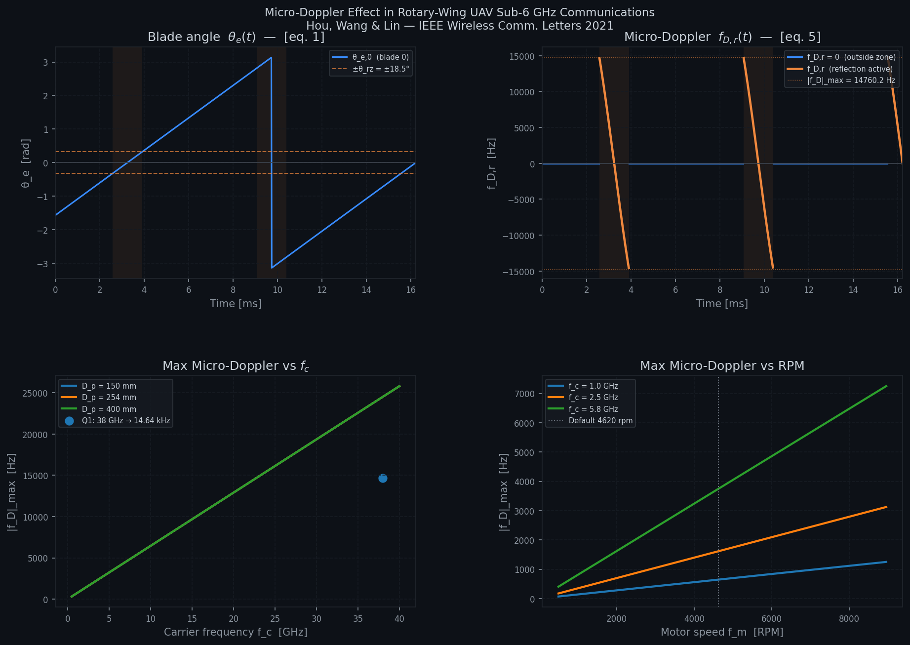
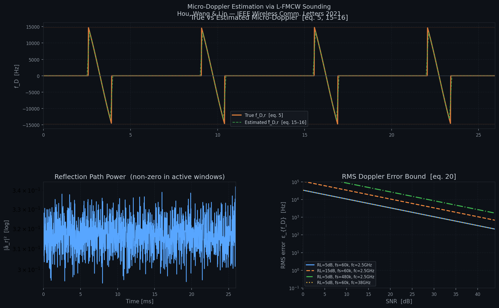

# Q1 — Analytical Scaling of Micro-Doppler Shift in Rotary-Wing UAV at 38 GHz

This repository reproduces and modifies the micro-Doppler simulation based on the paper **“Micro-Doppler Shift and Its Estimation in Rotary-Wing UAV Sub-6 GHz Communications”**.

The goal of this assignment is to analyze how the maximum micro-Doppler shift changes when the carrier frequency is scaled from **2.5 GHz** to **38 GHz mmWave band**, while keeping the original physical UAV parameters unchanged.

The original paper reports:

- **Carrier frequency:** 2.5 GHz
- **Motor speed:** 4620 RPM
- **Maximum micro-Doppler shift:** 963.09 Hz

In this modified experiment, the carrier frequency is changed to:

- **Carrier frequency:** 38 GHz

The main objective is to calculate the new maximum micro-Doppler shift and determine the minimum sampling frequency required to avoid phase ambiguity.

---

## 1. Project Objectives

This project focuses on the following tasks:

1. Modify the original micro-Doppler simulation repository for the **38 GHz mmWave band**.
2. Calculate the maximum micro-Doppler shift at 38 GHz.
3. Determine the minimum sampling frequency required to keep the estimated phase within the principal value range $[-\pi,\pi]$.
4. Compare the analytical scaling result with the simulation output.
5. Discuss why 60 kSPS is selected as a practical sampling frequency.

---

## 2. Repository Structure

```text
Micro-Doppler-Shift_Rotary-Wing-Sub6Ghz/
├── microdoppler_channel.py              # Analytical micro-Doppler channel simulation
├── microdoppler_estimation.py           # L-FMCW-based micro-Doppler estimation
├── microdoppler_results.png             # Channel simulation result figure
├── microdoppler_estimation_results.png  # Doppler estimation result figure
└── README.md                            # Project description and result analysis
```

---

## 3. Environment Setup

### 3.1 Recommended Environment

This project was tested using:

- Python 3.13
- NumPy
- SciPy
- Matplotlib

### 3.2 Install Dependencies

Install the required packages:

```bash
pip install numpy scipy matplotlib
```

If you are using Windows PowerShell, run the scripts with:

```powershell
python microdoppler_channel.py
python microdoppler_estimation.py
```

---

## 4. How to Run

### 4.1 Run the Micro-Doppler Channel Simulation

```bash
python microdoppler_channel.py
```

This script generates:

```text
microdoppler_results.png
```

The figure contains:

- blade angle versus time;
- micro-Doppler shift versus time;
- maximum micro-Doppler shift versus carrier frequency;
- maximum micro-Doppler shift versus motor speed.

---

### 4.2 Run the Micro-Doppler Estimation Simulation

```bash
python microdoppler_estimation.py
```

This script generates:

```text
microdoppler_estimation_results.png
```

The figure contains:

- true and estimated micro-Doppler shift;
- reflection path power;
- RMS Doppler error bound.

---

## 5. Code Modification

The main modification is applied in `microdoppler_channel.py`.

The carrier frequency was changed from the original sub-6 GHz setting:

```python
"fc": 2.5e9
```

to the 38 GHz mmWave setting:

```python
"fc": 38e9
```

The sampling frequency was set to:

```python
"fs": 60e3
```

The modified parameter setting is:

```python
DEFAULT_PARAMS = {
    "Dp": 0.254,
    "fm": 4620 / 60,
    "Nb": 2,
    "fc": 38e9,
    "dUE": 1000.0,
    "dant": 0.200,
    "RL": 5.0,
    "fs": 60e3,
    "SNR": 40.0,
    "theta_p0": 0.0,
    "Navg": 4,
}
```

In addition, the carrier-frequency plotting range was extended to include the 38 GHz region:

```python
fc_range = np.linspace(0.5e9, 40e9, 500)
```

A marker was also added to indicate the Q1 result at 38 GHz.

---

## 6. Program Output

After modifying the carrier frequency to 38 GHz, the following output was obtained from `microdoppler_channel.py`:

```text
==============================================================
  Micro-Doppler Channel  —  Hou, Wang & Lin (2021)
==============================================================
  Motor speed   f_m  = 4620 rpm  (77.000 rev/s)
  Carrier freq  f_c  = 38.00 GHz
  Prop. diam.   D_p  = 254.0 mm
  Ant. offset   d_ant= 200.0 mm
  Num. blades   N_b  = 2
--------------------------------------------------------------
  θ_rz   = 18.51°  = 0.3231 rad      [eq. 4]
  Period = 6.494 ms  (60 / (fm·Nb))
  Refl.  = 1.336 ms  per reflection window
  |f_D|_max = 14760.24 Hz  (at θ_e = ±π/4)    [eq. 5]
==============================================================

Q1 Analytical Scaling
--------------------------------------------------------------
Scaled maximum micro-Doppler at 38.0 GHz = 14638.968 Hz
Theoretical minimum sampling frequency = 29.278 kSPS
Phase increment at fs = 30 kSPS = 3.066 rad = 0.976π
Phase increment at fs = 60 kSPS = 1.533 rad = 0.488π
Recommended practical fs = 60 kSPS
```

The output from `microdoppler_estimation.py` was:

```text
==============================================================
  Micro-Doppler Estimation  —  Hou, Wang & Lin (2021)
==============================================================
  Theoretical RMS error bound [eq. 20]: 339.63 Hz
  Paper reports:                         18.83 Hz  (at 40dB SNR)

  Running L-FMCW estimation pipeline … done.
  Simulated RMS error (in-zone): 1473.04 Hz
  → Saved: microdoppler_estimation_results.png
```

---

## 7. Experimental Results and Analysis

### 7.1 Micro-Doppler Channel Simulation



The channel simulation result shows four main plots.

#### Blade Angle

The blade angle $\theta_e(t)$ changes periodically due to the rotary-wing motion.

The shaded regions represent the active reflection windows where the propeller blade contributes to the reflected path.

#### Micro-Doppler Shift

The micro-Doppler shift becomes nonzero only during the active reflection windows.

After changing the carrier frequency to 38 GHz, the maximum micro-Doppler shift increases to approximately:

$$
14.76\ \text{kHz}
$$

This confirms that the micro-Doppler effect becomes much stronger at mmWave frequencies.

#### Maximum Micro-Doppler versus Carrier Frequency

The plot shows that the maximum micro-Doppler shift increases linearly with carrier frequency.

The marker at 38 GHz shows the analytical Q1 result:

$$
38\ \text{GHz}
\rightarrow
14.64\ \text{kHz}
$$

#### Maximum Micro-Doppler versus RPM

The result also shows that the maximum micro-Doppler shift increases linearly with motor speed.

This is consistent with the analytical formula, since $f_{D,r}$ is proportional to the motor revolution frequency $f_m$.

---

### 7.2 Micro-Doppler Estimation Result



The estimation result shows that the estimated micro-Doppler follows the trend of the true micro-Doppler during the active reflection windows.

The top figure compares:

- true micro-Doppler shift;
- estimated micro-Doppler shift.

The estimated curve follows the true curve, but small estimation errors can still be observed, especially near discontinuities and reflection-window boundaries.

The bottom-left figure shows the reflection path power.

The reflection power is nonzero during the active reflection windows.

The bottom-right figure shows the RMS Doppler error bound versus SNR.

As SNR increases, the theoretical RMS error bound decreases. This means that higher SNR improves the reliability of the micro-Doppler estimation.

---

## 8. Conclusion

This project modifies the original rotary-wing UAV micro-Doppler simulation from a 2.5 GHz sub-6 GHz carrier to a 38 GHz mmWave carrier.

The results show that the maximum micro-Doppler shift increases from approximately **963 Hz** to approximately **14.64 kHz** due to the linear dependence on carrier frequency.

The theoretical sampling frequency required to avoid phase ambiguity is approximately **29.28 kSPS**. However, because 30 kSPS leaves only a very small phase margin, **60 kSPS** is selected as the practical sampling frequency.

This confirms that mmWave UAV communication systems require more careful Doppler estimation and higher sampling rates to maintain reliable communication under propeller-induced micro-Doppler interference.
